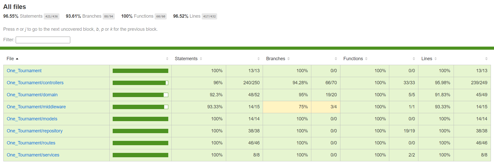
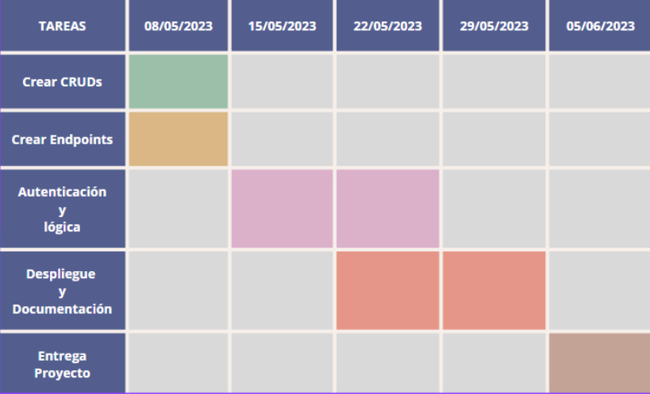

# One_Tournament

---

## Introduccion

### Que es?

One Tournament es una API enfocada para tiendas de cartas que busquen tener torneos en tienda. Las tiendas obtendrán Endpoints para generar torneos y añadir los jugadores a dichos torneos.

### Que objetivo tiene?

Cumple como objetivo unificar la organizacion del torneo , con el calculo de rondas y resulado final, siguiendo las normas oficiales de torneo y evitar terceros para calcular las rondas.

### Como determinar las rondas.

| Número de Participantes | Número Esperado de Rondas Suizas | Jugadores Clasificados para el Corte Superior (si aplica) |
| ----------------------- | -------------------------------- | --------------------------------------------------------- |
| 4 - 8                   | 3 rondas                         | Ninguno                                                   |
| 9 - 16                  | 4 rondas                         | Los 2 mejores                                             |
| 17 - 32                 | 5 rondas                         | Los 4 mejores                                             |
| 33 - 64                 | 6 rondas                         | Los 8 mejores                                             |
| 65 - 128                | 7 rondas                         | Los 8 mejores                                             |
| 129 - 256               | 8 rondas                         | Los 16 mejores                                            |
| 257 - 512               | 9 rondas                         | Los 16 mejores                                            |
| 513 - 1024              | 10 rondas                        | Los 32 mejores                                            |

### En la aplicacion

Para que no haya fallos en a la hora de calcular punto se pide que se use la tabla anterior para determinar las rondas del torneo , que el jugador con el BYE , se tiene que actualizar su resultado como "W" y que los jugadores que obtengan empate , se tiene que actualizar su resultado como "D" a cada uno.

## Instalacion del proyecto

### Requisitos Previos

Antes de comenzar, asegúrate de tener instalado lo siguiente:

- [`Node`](https://nodejs.org/en): (v12 o superior)
- [`Mongo Atlas`](https://www.mongodb.com/atlas/database): una cuenta con la cual crear base de datos.
- [`Yarn`(opcional)](https://yarnpkg.com/): recomendado para la gestion de paquetes del proyecto

### Instalacion

- Descargar el código fuente: desde el repositorio `https://github.com/ErikPC/One_Tournament`

- Vamos con la terminal a la raiz: comando `cd` para navegar a la carpeta raíz del proyecto en la terminal.

- Instalar dependencias: ejecuta el siguiente comando para instalar todas las dependencias del proyecto

```
yarn install
```

leerá el archivo package.json y descargará todas las dependencias y paquetes necesarios para que el proyecto funcione correctamente.

- Iniciar la aplicación: el package json tiene definido el siguiente script para iniciarse

```
yarn start
```

## Dependecias package.json & scripts

### Dependencias

- `dotenv`: Permite cargar variables de entorno desde un archivo .env en el proyecto. Esto facilita la configuración de valores sensibles como la URI de mongo Atlas.

- `bcryptjs`: Es una librería para el hashing de contraseñas. Proporciona funciones para encriptar y comparar contraseñas de forma segura.

- `express`: Es un framework web rápido Node.js. Facilita la creación de aplicaciones web y APIs con el uso de , middleware y solicitudes HTTP.

- `jest`: Es para las unitarias para JavaScript. Proporciona una amplia gama de herramientas y funciones para escribir y ejecutar pruebas de forma sencilla y eficiente.

- `jsonwebtoken`: Permite generar y verificar tokens de autenticación basados en JSON.

- `moment`: Es una librería para manipular, analizar y formatear fechas y horas en JavaScript.

- `mongoose`: Es una biblioteca de modelado de objetos para Node.js que se utiliza para interactuar con bases de datos MongoDB.

- `nodemon`: Es una herramienta de desarrollo que supervisa los cambios en los archivos del proyecto y reinicia automáticamente el servidor Node.js cuando se detectan cambios. Para el desarrollo en entorno dev.

- `supertest`: Es una librería para realizar pruebas de integración en aplicaciones web y APIs. Permite enviar solicitudes HTTP simuladas y verificar las respuestas recibidas.

### Scripts

- `start`: Ejecuta la aplicación principal utilizando el comando node index.js.

- `dev`: Ejecuta la aplicación en modo de desarrollo utilizando nodemon index.js, lo que reinicia automáticamente el servidor al detectar cambios en los archivos.

- `test`: Ejecuta las pruebas utilizando Jest, un framework de pruebas para JavaScript.

- `coverage`: Ejecuta las pruebas y genera un informe de cobertura utilizando Jest.

- `docker`: Realiza la imagen del la API.

- `docker-push`: Sube la imagen del docker para su despliegue.

## Despligue

El despliegue no ha podido ser realizado en DigitalOcean. Pero como solucion se ha preparado la creacion de un docker para facilitar su despliegue.

### Docker

Para desplegar la imagen, simplemente hay que descargarla de [erikpc](https://hub.docker.com/u/erikpc) o crear la imagen con los siguientes pasos:

En la raíz del proyecto se crea la imagen del docker usando `yarn docker`

Para desplegar la api con la imagen docker se lanza :

`docker run -p puerto_host:puerto_contenedor -e MONGO_URI="mongodb+srv:<usuario>:<contraseña>@cluster0.qefhjrm.mongodb.net/test" -e SECRET_TOKEN="<hash>"
 -e PORT=3000 -e MONGO_URI_TEST="mongodb+srv://<usuario>:<contraseña>@cluster0.qefhjrm.mongodb net/test_one_tournament" erikpc/onetournament
`

Hay que cambiar <usuario> , <contraseña> por tu usuario y contrase de la base de datos de mongo y <puerto_host> , <puerto_contenedor> con los puertos que deseas utilizar en tu droplet. No hay que olvidar el <hash>, que es un conjunto de letras, numeros con mayusculas para encriptar la contraseña.

## Lógica

### Lista jugadores

Se obtiene la lista de jugadores ordenada por puntos , seguido de pairing. Asi ya se obtendran el orden de posiciones.

### Emparejamiento

Después de obtener una lista de jugadores que participaran hay que hacer los emparejamientos, de forma que tambien hay que tener en cuenta si son impares , lo cual el jugador con menos puntuacion se le asignara un "BYE", que es una "W".

```JS
function emparejar(listaJugadores) {
  let parejas = [];

  for (let i = 0; i < listaJugadores.length - 1; i += 2) {
    let jugador1 = listaJugadores[i];
    let jugador2 = listaJugadores[i + 1];

    // Crea la pareja
    let pareja = {
      jugador1: {
        nombre: jugador1.nombre,
        puntos: jugador1.puntos,
      },
      jugador2: {
        nombre: jugador2.nombre,
        puntos: jugador2.puntos,
      },
    };

    parejas.push(pareja);
  }

  // Si queda un jugador sin pareja, asigna un "BYE" al jugador
  if (listaJugadores.length % 2 !== 0) {
    let jugadorBye = listaJugadores[listaJugadores.length - 1];

    // asigna el jugador con "BYE"
    let parejaBye = {
      jugador1: {
        nombre: jugadorBye.nombre,
        puntos: jugadorBye.puntos,
        bye: true,
      },
    };

    parejas.push(parejaBye);
  }

  return parejas;
}
```

### Pairing

El pairing es algo parecido a una subpuntuacion que obtienen los jugadores para determinar quien esta mas alto en la tabla de puntos. La manera en que la determino es pasandole el ganador y luego el perdedor. La puntuacion se modificará en funcion de cuantos puntos tengan en el torneo los jugadores.

Para más informacion le recomiendo que en la bibliografía vaya Ruling Tournament para ver especificamente el funcionamiento

```JS
async function actualizarPairing(ganador, perdedor) {
  if (ganador.resultado === "D" && perdedor.resultado === "D") {
    ganador.resultado = "D";
    perdedor.resultado = "D";
    ganador.pairing += 1;
    perdedor.pairing += 1;
  } else if (ganador.puntosTorneo === perdedor.puntosTorneo) {
    ganador.pairing += 1;
    perdedor.pairing -= 1;
    ganador.resultado = "W";
    perdedor.resultado = "L";
  } else if (ganador.puntosTorneo > perdedor.puntosTorneo) {
    perdedor.pairing -= 1;
    ganador.resultado = "W";
    perdedor.resultado = "L";
  } else {
    ganador.pairing += 2;
    perdedor.pairing -= 1;
    ganador.resultado = "W";
    perdedor.resultado = "L";
  }

  // Guardar los cambios en la base de datos
  await repository.updateJugador(ganador.nombre, {
    pairing: ganador.pairing,
    resultado: ganador.resultado,
  });
  await repository.updateJugador(perdedor.nombre, {
    pairing: perdedor.pairing,
    resultado: perdedor.resultado,
  });
}
```

### Puntuaje

La puntuacion es simple:

- 3 Puntos en caso de victoria
- 0 Puntos en caso de derrota
- 1 Punto en caso de empate

## Coverage Test:

Con jest se pudo exportar un coverage. En el siguiente [file.html](./coverage/lcov-report/index.html) aparece la cobertura de los test:

Aquí tienes un resumen rápido



## Metologías

Se ha usado una metodología agil de desarrollo basada en sprints llamada Scrum.

Se ha usado la idea de los sprints para tener claro como avanzar de forma continua y con las ideas claras.

Su uso ha facilitado bastante el desarrollo de la aplicación. Pero no veo que se se adapte demasiado a imprevistos.

## Horas dedicadas

No hay un seguimiento correcto de las horas. En el inicio estuve haciendo horas intermitentes , entoces a veces si me olvidaba activar el clockify, asi que no hay una inversion exacta.

### Tiempo estimado



#### Estimaciones correctas:

- Crear CRUDs
- Autenticación
- Lógica
- Documentacion

#### Estimaciones incorrectas porque:

- Crear Endpoints
  - A medida que iba avanzando la aplicacion por comodidad del usuario han ido apareciendo endpoints y para ayuda de la lógica
- El despliegue
  - No se ha podido dar por bajo presupuesto.

## Bibliografía

[MongoDB Atlas](https://www.mongodb.com/cloud/atlas) - Plataforma de base de datos en la nube de MongoDB.

[Yarn](https://yarnpkg.com/) - Administrador de paquetes para JavaScript.

[dotenv](https://www.npmjs.com/package/dotenv) - Paquete de Node.js que carga variables de entorno desde un archivo .env.

[bcryptjs](https://www.npmjs.com/package/bcryptjs) - Librería para el hashing y comparación de contraseñas.

[Express](https://expressjs.com/) - Framework web rápido, minimalista y flexible para Node.js.

[Jest](https://jestjs.io/) - Framework de pruebas unitarias para JavaScript.

[jsonwebtoken](https://www.npmjs.com/package/jsonwebtoken) - Implementación de JSON Web Tokens (JWT) para Node.js.

[Moment.js](https://momentjs.com/) - Biblioteca para manipulación de fechas y horas en JavaScript.

[Mongoose](https://mongoosejs.com/) - Herramienta de modelado de objetos MongoDB para Node.js.

[Nodemon](https://nodemon.io/) - Utilidad que monitoriza cambios en archivos y reinicia automáticamente la aplicación.

[Supertest](https://www.npmjs.com/package/supertest) - Marco de pruebas de integración para aplicaciones HTTP.

[Ruling Tournament](https://en.onepiece-cardgame.com/pdf/tournament_rules_manual.pdf?20230407) - Reglamento oficial de torneos de One Piece TCG.
